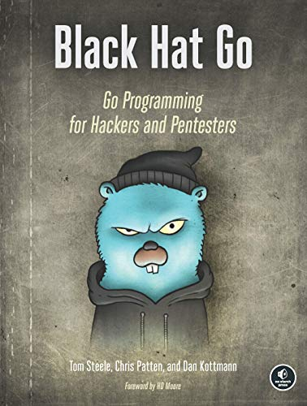
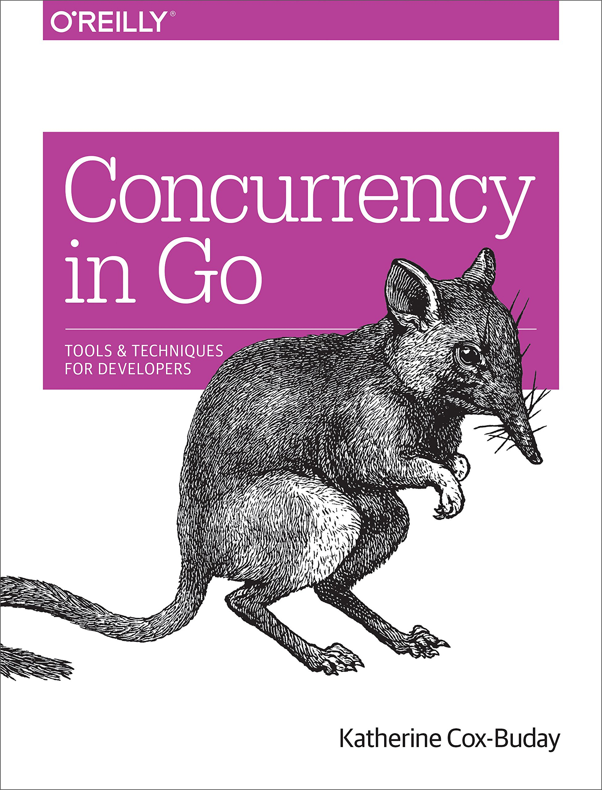
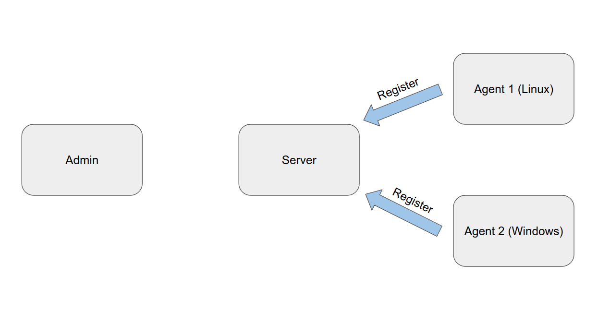
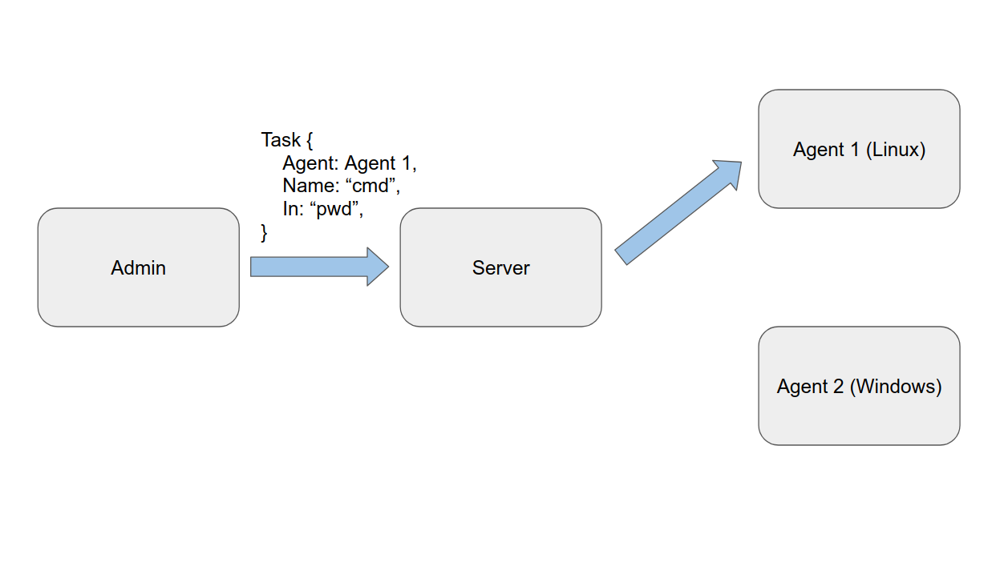
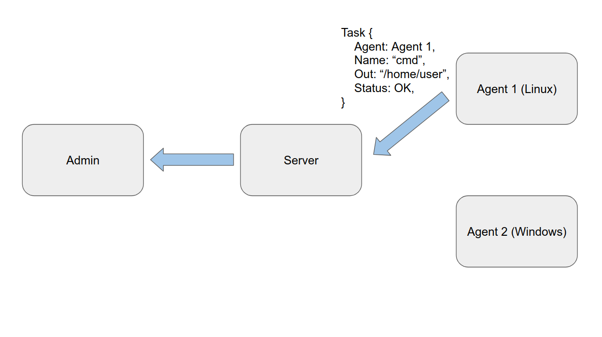

## What this talk **isn't**
- A Go tutorial
- A novel cyber security tool demo


## What this talk **is**
- An overview of Go features that are useful for cyber / hacking
- A project demo that highlights those features 


## Agenda
### Brief Introduction to Go
- Goals of the language
- Features of Go
 
### Why Use Go?
- Interfaces
- Concurrency
- Cross compilation

### Example Project
- Black Hat Go - Chapter 14: "Building a Command-and-Control RAT"
- Design, implementation, and demo

### Downsides to Go
- Use the right tool for the job


# Introduction to Go

## The Go Programming Language
> "Go is an open source programming language that makes it easy to build simple, 
> reliable, and efficient software."

\- golang.org


## The Go Programming Language

### Language goals
- Expressive
- Efficient compilation and exeuction
- Effective for writing reliable and robust software

### Traditional applications
- Infrastructure
- Networked services
- Programmer tools/systems

## The Go Programming Language

### Features
- A "C-like language"
- Statically compiled with a runtime
  - Efficient machine code
  - Garbage collection
- New concurrency methods
- Expressive
- Type safe
- Powerful tools
	- build, test, manage packages


# Why Use Go in Cyber Security?

## Black Hat Go
{ width=650px }


## Why Use Go in Cyber Security?

### Useful features
- Extensive standard library
- Package system
- Integrated tooling (the go binary)
- Testing

## Go interfaces

### Interfaces generalize behaviors of other types
- Abstract type
- Define a set of methods that a type must implement
- Implicitly satisfied

## Go interfaces

### Example interface:  io.Writer
```go
type Writer interface {
	Write(p []byte) (n int, err error)
}
```
- Any type with the specified Write() satisfies the interface
- Any variable of type io.Writer can accept any type that satisfies the interface
- Allows for abstractions and extensible, testable code

## Concurrency in Go
{ width=650px }

## Concurrency

### C pthreads

```c
pthread_create(&thread, NULL, my_function, (void *)args);
```

### Go routines

```go
go myFunction(args)
```

### Go leverages `channels` for communicating between go routines
- Channels send and receive data and can indicate go routine status


## Leveraging concurrency for cyber security

### Writing code to exploit race conditions
- Example: Dirty Cow
- Use go routines instead of pthreads to attempt to win the race
- Full port of exploit in Black Hat Go chapter 9


## Cross compilation

> "One of the best features in Go is its ability to cross compile executables."

\- Black Hat Go


## Cross compiling binaries with Go

```bash
$ go version
go version go1.15.1 linux/amd64

$ go build test.go

$ file test
test: ELF 64-bit LSB executable, x86-64, version 1 (SYSV), 
statically linked, not stripped
```

## Cross compiling binaries with Go

```bash
$ GOOS=windows GOARCH=386 go build test.go

$ file test.exe
test.exe: PE32 executable (console) Intel 80386 (stripped to 
external PDB), for MS Windows 
```

## List of supported operating systems and architectures

`go tool dist list`

::: columns
::::{.column width=30%}
- aix/ppc64
- android/386
- android/amd64
- android/arm
- android/arm64
- darwin/amd64
- darwin/arm64
- dragonfly/amd64
- freebsd/386
- freebsd/amd64
- freebsd/arm
- freebsd/arm64
- illumos/amd64
- js/wasm
::::
::::{.column width=25%}
- linux/386
- linux/amd64
- linux/arm
- linux/arm64
- linux/mips
- linux/mips64
- linux/mips64le
- linux/mipsle
- linux/ppc64
- linux/ppc64le
- linux/riscv64
- linux/s390x
::::
::::{.column width=25%}
- netbsd/386
- netbsd/amd64
- netbsd/arm
- netbsd/arm64
- openbsd/386
- openbsd/amd64
- openbsd/arm
- openbsd/arm64
- plan9/386
- plan9/amd64
- plan9/arm
- solaris/amd64
- windows/386
- windows/amd64
- windows/arm
::::
:::


## Go build constraints

### Mechanisms for writing OS/arch specific implementations
- File names
    - `file_windows.go`, `file_386.go`, `file_linux_amd64`, etc
- Include comments in source files
    - `// +build linux darwin`
    - `// +build !windows`
- The Go tool chain will use the appropriate code based on `GOOS` and `GOARCH`


## Leveraging cross compilation for cyber security

### Cross compilation becomes trivial
- Minimal - if any - modifications to source code
- Simple mechanism for writing OS or architecture specific code
- No additional dependencies or compilers for most OS/arch pairs


# Example Application

## An example application

> In this chapter, we'll... build a basic command and control (C2) remote
> access trojan (RAT).

\- Black Hat Go Chapter 14


## Designing the C2 framework

### Goals
- Practice writing idiomatic Go
- Robust and extensible

### Design
- Series of Go packages
	- admin - user interface for tasking agents (~300 LoC)
    - agent - fetch-do loop to run on a remote system (~300 LoC)
    - api - `gRPC` protocol for tasking agents (~60 LoC)
	- **module** - interfaces for writing modular code for agents and admins (~730 LoC)
    - server - server for relaying communications between agents and admins (~210 LoC)

## Project Walkthrough

- Communications API
- Module interfaces
- Admin 
- Agent
- Example dummy module

## API - Dataflow



## API - Dataflow



## API - Dataflow



## Module interfaces

```go
// Admin modules create and send tasks to Agents
type Admin interface {
	CreateTask([]string) (*api.Task, error)
	Do(*api.Task) error
}

// Agent modules handle tasks from Admin clients
type Agent interface {
	CreateResponse() (*api.Task, error)
	Do(*api.Task) error
}
```

## Modules

### Implemented modules
- exec - command execution
- file - upload and download file modules
- kill - instructs an Agent to exit
- http - start or stop an http server on the remote machine

## Module - Example: dummy Admin

```go
func (mod *Admin) CreateTask(args []string) (*api.Task, error) {
	var err error
	task := &api.Task{
		Name:   mod.Name(),
		Status: api.Task_ERROR,
	}
	config := dummyConfig{
		// initialize config based on task/args
	}
	task.In, err = module.EncodeConfig(config)
	if err != nil {
		return task, err
	}
	task.Status = api.Task_OK
	return task, nil
}
```

## Module - Example: dummy Admin

```go
func (mod *Admin) Do(resp *api.Task) error {
	fmt.Printf("\n[%s:%s::%]\ndummy module done!\n",
		resp.Agent.GetUuid(),
		mod.Name(),
		resp.GetStatus())
	return nil
}
```

## Module - Example: dummy Agent

```go
func (mod *Agent) Do(task *api.Task) error {	
	var config dummyConfig

	if err := module.DecodeConfig(task.In, &config); err != nil {
		m.Status = api.Task_ERROR
		return err
	}
	fmt.Println("calling Do() from dummy module!")
	mod.doSomethingWithConfig(config)
	return nil
}
```

## Module - Example: dummy Agent

```go
func (mod *Agent) CreateResponse() (*api.Task, error) {
	task := &api.Task{
		Status: api.Task_OK,
	}
	return task, nil
}
```

## Want to see the code?

### Available on GitHub
- https://github.com/1stl0ve/avengercon/
- Contains both source code and presentation slides

# Demo

## Downsides to Go

### Go is not always the best tool for the job...
- Produces large, static binaries
- Does not support inline assembly
- It's difficult to make it do stuff that its not supposed to

# ...but sometimes it is!

## References

The Go Programming Language, 2020, https://golang.org.

Cox-Buday, Katherine. Concurrency in Go: Tools and Techniques for Developers. " O'Reilly Media, Inc.", 2017.

Donovan, Alan AA, and Brian W. Kernighan. The Go programming language. Addison-Wesley Professional, 2015.

Steele, Tom, Chris Patten, and Dan Kottmann. Black Hat Go: Go Programming for Hackers and Pentesters. No Startch Press, 2020.